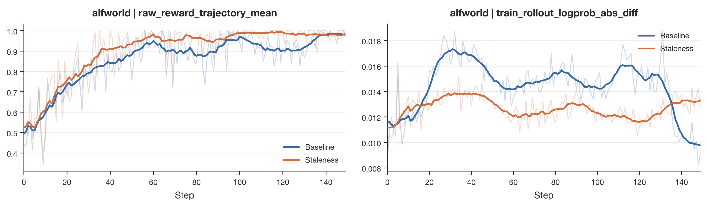
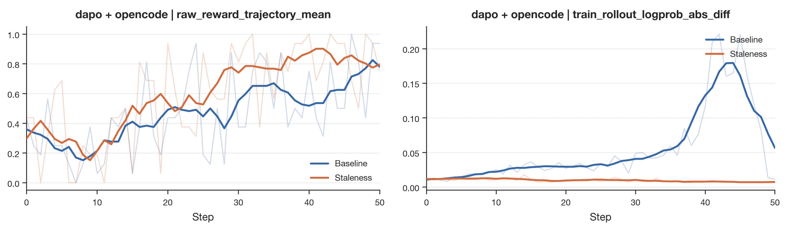

# Staleness Control

[← Back to Main README](../README.md)

## Overview

Dressage runs rollout and training in parallel during async training. This greatly improves throughput, but it also introduces staleness: the policy being updated by the trainer may no longer match the policy that produced the rollout samples. If this gap keeps growing, the trainer repeatedly consumes data generated by old policies, rollout logprobs drift away from current-policy logprobs, the train-inference gap widens, the training signal becomes noisier, and in severe cases training can drift or even collapse.

Dressage controls staleness in two scenarios. The first is async batch collection: the trainer-side batch is restricted to trajectories from the most recent weight versions. The second is partial rollout: a long trajectory that is repeatedly interrupted and resumed is restricted in how many weight versions it may span, preventing excessive version mixing inside a single sample.

## Batch-Level Staleness Control

The first control happens while async rollout is collecting a trainer batch. The configuration entry is:

```yaml
# examples/scripts/default/dressage_staleness.yaml
dressage_staleness_keep_versions: 0
```

Async run scripts load this file through `--custom-config-path "${SCRIPT_DIR}/default/dressage_staleness.yaml"`, for example `examples/scripts/run_alfworld_whitebox_agent_qwen3.5_4b_async.sh`, `examples/scripts/run_blackbox_qwen3.5_4b_async_local.sh`, and the corresponding partial async scripts. `dressage_staleness_keep_versions` means: within the batch consumed by the trainer, how many most-recent observed model versions may be present at most.

- `0`: disables batch-level staleness control.
- `N > 0`: keeps only the most recent `N` observed versions. For example, with `keep_versions=2`, the batch may contain data from the current latest version and the immediately previous version; groups whose trajectories come from older versions are dropped.

The core implementation lives in `dressage/rollout/staleness.py`:

- `config_from_args()` builds `StalenessConfig` from `args.dressage_staleness_keep_versions` and rejects negative values.
- `StalenessTracker` maintains versions in observation order, rather than sorting version labels lexicographically.
- `StalenessGroupFilter` observes new versions, filters pending groups, and checks whether newly completed groups may enter the batch in both fully async and partial async collection loops.

### Version Is Trajectory-Level

Each training sample writes version metadata in `dressage/rollout/artifacts/samples.py`:

- `full_versions`: token-level versions for the sample token sequence.
- `version_spans`: compressed version spans.
- `dressage_start_token_version` / `dressage_end_token_version`: start and end versions of trainable output tokens.

Batch-level staleness control uses `dressage_end_token_version` as the trajectory version. This is a trajectory-level decision, not a token-level or segment-level one: all samples belonging to the same trajectory are grouped by `parent_traj_id`, and the trajectory is represented by the last trainable token version of the whole trajectory.

For multi-segment / multi-version scenarios, `trajectory_version_infos()` groups samples by `parent_traj_id` and selects the last segment according to `segment_index`; if multiple samples share the same `segment_index`, it chooses the one that appears later in the group. This prevents early stale segments from causing the whole trajectory to be misclassified. In pure async training without partial rollout, the proxy rejects non-partial trajectories that try to continue across versions, so a single trajectory usually does not contain multiple versioned segments. The segment-selection logic mainly exists to stay compatible with partial rollout and multi-segment expansion.

### Filtering Flow

In `dressage/rollout/fully_async_rollout.py` and `dressage/rollout/partial_async_rollout.py`, batch collection roughly follows this flow:

1. The background worker continuously pulls prompt groups from the data buffer and runs rollout.
2. The main collection loop continuously drains completed groups from the worker's completed queue.
3. Whenever a completed group reveals a new version, `StalenessTracker` advances the current version window.
4. If the version window advances, pending groups that have already been placed into the candidate training batch are filtered again; groups outside the window are removed.
5. For each newly completed group that is about to enter the batch, `keep_group()` checks it once more; if any versioned trajectory in the group is stale, the entire group is dropped.

The drop granularity is the **GRPO group**, not an individual sample or segment. GRPO advantage normalization depends on group structure; deleting only some trajectories or segments inside a group would change the group's statistics and introduce another training bias.

The implementation also handles incomplete metadata. If a sample is missing `parent_traj_id` or a real version value such as `unknown`, `-1`, or an empty string, it does not advance the version tracker and does not trigger a drop by itself. This ensures staleness control only acts on reliable version information.

### AlfWorld Async Result

In the AlfWorld async experiment, we set `keep_versions=2` and compared the baseline against staleness control. The result shows that reward converges in fewer steps with staleness control, while `train_rollout_logprob_abs_diff` is clearly reduced. This indicates that the trainer is consuming data closer to the current policy, reducing interference from stale rollout data.



## Partial Rollout Staleness Control

The second control is designed for partial rollout. Partial rollout allows a long generation to be interrupted on a weight update and then resumed with the newer weights. This avoids discarding an entire long trajectory, but if one trajectory is interrupted too many times, it can span too many model versions: old-version tokens and new-version tokens become mixed in the same trajectory, and the trajectory prefix, tool-call history, and environment state may be mostly determined by an older policy. Even if training only keeps loss on the final-version tokens, the sample is still continued from a stale prefix and stale state distribution, making it less informative and potentially adding bias and noise to the current policy update.

The relevant proxy parameters are in `dressage/proxy/server.py`:

- `--dressage-partial-rollout`: allows interrupted SGLang generations to resume from partial output.
- `--record-token-versions`: records token-level model weight versions.
- `--max-partial-rollout-preempts`: limits the maximum number of model-version switches allowed in one partial rollout session. With value `2`, one trajectory may span at most `3` versions; beyond that, the proxy refuses to continue generation.

Partial rollout is usually used together with `--mask-nonlast-version-tokens`: that flag belongs to the training sample construction stage and masks loss so only tokens from the last real output version are trained. The staleness control described here focuses on the rollout stage: it limits the trajectory's version span so excessive old-version content does not enter the same trajectory.

`_raise_if_partial_version_span_exceeded()` merges the session's historical response versions with the current candidate response versions, removes non-real versions, and computes `version_span` in observation order:

```text
version_switches = max(0, version_span - 1)
```

If `version_switches > max_partial_rollout_preempts`, the proxy returns HTTP 502 with error name `partial_rollout_staleness_exceeded`, and the response detail includes `versions`, `version_span`, `version_switches`, `max_preempts`, and `max_version_span`. This happens on the rollout side, so the over-limit trajectory is stopped instead of continuing generation along a partial trajectory that has already crossed too many versions.

The async rollout collector treats this 502 as a failed group. The current implementation uses the unified failure path: by default it performs bounded prompt-group retries according to `DRESSAGE_ROLLOUT_MAX_RETRIES`; the old partial trajectory is not resumed further, and the group is dropped after exhausting retries. The partial async path also tracks staleness failure counts so we can observe how often this control is triggered. Sample metadata keeps `full_versions` and `version_spans`, and rollout logging further reports `staleness/version_span_mean`, `staleness/version_span_max`, and `staleness/version_span_min` to show whether partial rollout is still spanning too many versions.

### DAPO + OpenCode Result

On the DAPO dataset with the blackbox OpenCode agent, we used partial rollout and set the maximum number of preempts to `2`. In this experiment, staleness control makes reward improve faster, and `train_rollout_logprob_abs_diff` drops substantially. This suggests that, in long-horizon / blackbox-agent settings, limiting the partial rollout version span effectively reduces the impact of stale prefixes and stale state distributions on training.



## Takeaways

Dressage staleness control is not a single switch; it consists of two controls for the async pipeline:

1. **Batch-level staleness control** keeps trainer batches within the most recent trajectory versions while preserving GRPO-group statistical consistency.
2. **Partial rollout staleness control** prevents a single long trajectory from spanning too many versions, reducing the effect of stale prefixes and stale state distributions on current-policy updates.

These two controls can also be enabled at the same time: batch-level filtering constrains which completed groups enter trainer batches, while partial rollout filtering constrains how much version drift any single resumed trajectory can accumulate.

Together, these mechanisms reduce the gap between rollout policy and training policy in async RL. The AlfWorld async experiment and the DAPO + OpenCode partial rollout experiment both show that staleness control improves reward learning speed and significantly reduces the difference between rollout logprobs and current-policy logprobs.
